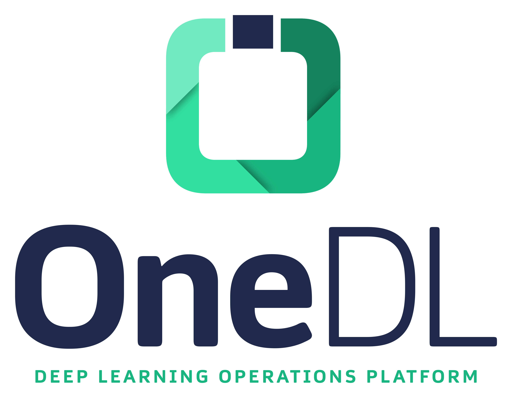

      
  
&nbsp;

  

  

&nbsp;

  
  &nbsp;
  

&nbsp;

VBTI is an AI engineering company that develops Deep Learning solutions for companies in areas such as agriculture and manufacturing. 
Our team consists of highly motivated, skilled and educated professionals who are enthusiastic about the field of AI and its application in the real world. 
We believe in a mix of young and old talent, both fresh and experienced minds that are needed to push AI into its next phase of development and concretely help companies perform better.

## OneDL

Here at VBTI we are developing OneDL.

  

    <b>
      
<a href="http://onedl.ai/" rel="some text">
  <picture>
    <!-- User prefers dark mode: -->
  <source srcset="../assets/onedl_logo_dark_trimmed.png"  media="(prefers-color-scheme: dark)"/>

  </picture>
</a>
    </b>
  

OneDL is an industry focused AI platform designed to support the entire lifecycle of your AI applications. 
Your team can directly focus on application development while saving time on developing IT tools for data management, data format conversions and stitching together open-source tools.
The OpenMMLabs vision and deep learning libraries are part of that.

We forked these libraries so we can update them with latest improvements and we want to give back to the open source community what we gained as well:
Access to a great deep learning training tool with the latest models from academia.

For now we focus ourselves on the most used repositories:

- [OneDL-PreTrain](https://github.com/vbti-development/onedl-mmpretrain): Pre-training and classificationtoolbox and benchmark.
- [OneDL-Detection](https://github.com/vbti-development/onedl-mmdetection): Object detection and instance segmentation toolbox and benchmark.
- [OneDL-Segmentation](https://github.com/vbti-development/onedl-mmsegmentation): Semantic segmentation toolbox and benchmark.
- [OneDL-Deploy](https://github.com/vbti-development/onedl-mmdeploy): Model deployment framework.
- [OneDL-Rotate](https://github.com/vbti-development/onedl-mmrotate): Rotated object detection toolbox and benchmark.

And their dependencies:
- [OneDL-MIM](https://github.com/vbti-development/onedl-mim): MIM installs VBTI  packages.
- [OneDL-Engine](https://github.com/vbti-development/onedl-mmengine): Foundational library for training deep learning models.
- [OneDL-CV](https://github.com/vbti-development/onedl-mmcv): Foundational library for computer vision.

We are only a small team, so any help will be appreciated.

## Migration guide
Using onedl-mmxxx should be directly interchangeable with mmxxx. Simply `pip install onedl-mim` instead of `openmim` and `mim install onedl-mmxxx` instead of `mim install mmxxx`. 
Most imports and functionality should have been maintained, except for some known issues. Look in repository specific installation instructions for more details.

## Roadmap
For the foreseeable future we will: 
- review and merge all pull requests submitted to all of the repositories in our organization
- make sure the CI pipelines will be kept up to date
- answer as much of the discussions and issues raised in the repositories within our allotted time.

We have set up a sponsorship program to ensure we also have the resources in the future to maintain these packages and maybe even develop new features.

